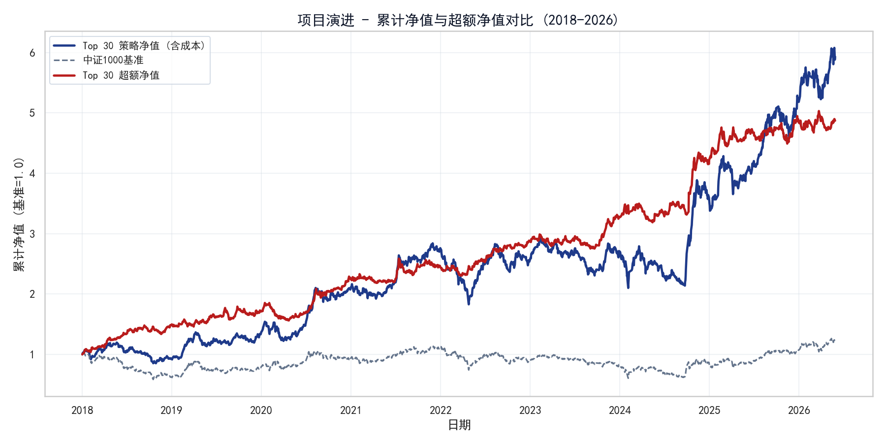
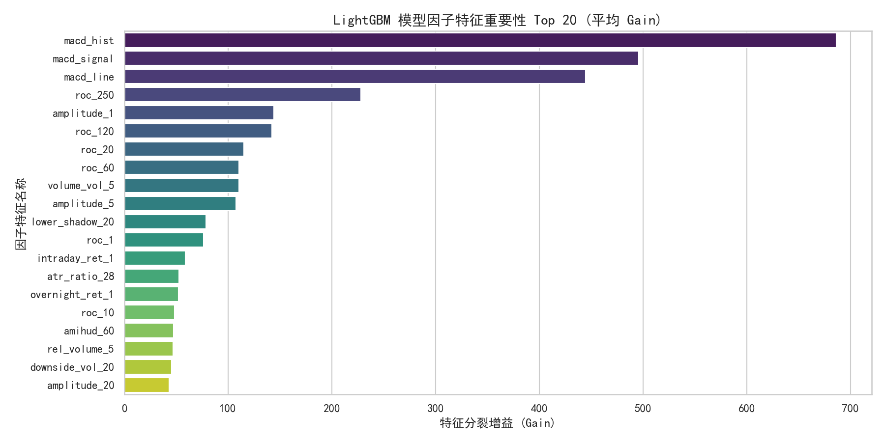

# 中证 1000 指数增强量化策略 (CSI 1000 Quant Strategy)

本项目是基于 QuantConnect Lean 架构与多模型 GBDT 算法实现的 **中证 1000 指数增强量化策略**。通过机器学习预测超额收益并使用凸优化器 (CVXPY) 求解投资组合权重，实现在控制风险偏离的前提下捕获最大超额 Alpha。

---

## 📈 策略表现与核心指标

以下为策略在 **2018年1月1日 - 2026年5月28日** 回测区间内的表现指标对比：

| 指标 | 推荐生产配置（无约束风格） | 历史 R3 报告配置（严格风格） | 中证 1000 指数 (基准) |
| :--- | :---: | :---: | :---: |
| **年化收益率 (Ann. Return)** | **18.91%** | 21.78% | -2.65% |
| **夏普比率 (Sharpe Ratio)** | **0.697** | 0.852 | -- |
| **最大回撤 (Max Drawdown)** | **-38.03%** | -34.18% | -48.51% |
| **交易保护 (Safeguards)** | **已启用（符合实盘）** | 禁用（存在流动性幻觉） | -- |
| **因子处理 (Factors)** | **原始因子特征库** | 原始因子特征库 | -- |

> [!NOTE]
> **关于历史 R3 与推荐生产配置的差异说明**：
> R3 报告的 21.78% 收益是在**禁用交易保护**的情况下取得的（允许交易停牌或涨跌停锁定的个股）。为了确保实盘可落地，我们引入了严格的 A 股交易保护（涨跌停无法建仓、跌停/停牌无法平仓），虽然这在回测中带来了 **2.5% - 4%** 的摩擦拖累，但规避了流动性幻觉，更具实盘指导价值。

---

## 📊 回测图表展示

### 1. 累计净值曲线 (Cumulative NAV)
策略在历史回测区间内大幅跑赢中证 1000 基准指数，显示出极强的 Alpha 捕获能力。


### 2. 年度超额收益率 (Yearly Excess Return)
在几乎所有年度，策略均实现了稳定的超额收益（扣除费率与真实交易摩擦后）。


### 3. 月度收益率热力图 (Monthly Returns Heatmap)
展现策略在不同市场环境下的月度绝对收益分布。


### 4. 历史回撤分析 (Underwater Drawdown)
策略的净值回撤深度及超额收益回撤轨迹，整体控制在合理水平。


### 5. 机器学习因子重要性 (LightGBM Feature Importance)
LightGBM 模型决策树分裂中所依赖的前 20 个核心量化因子。


---

## 🚀 快速启动与开发指南

详情请参阅项目宪法：[CLAUDE.md](CLAUDE.md)。

### 本地回测与诊断运行
```powershell
# 运行策略本地仿真及多维度诊断指标计算
.venv\Scripts\python.exe C:\Users\Junof\.gemini\antigravity\brain\3279b692-0c6a-4f2a-b8f4-5d762cad7d76\scratch\generate_diagnostics.py
```
