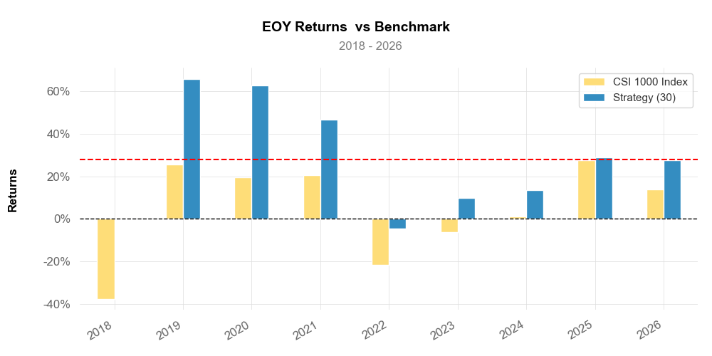
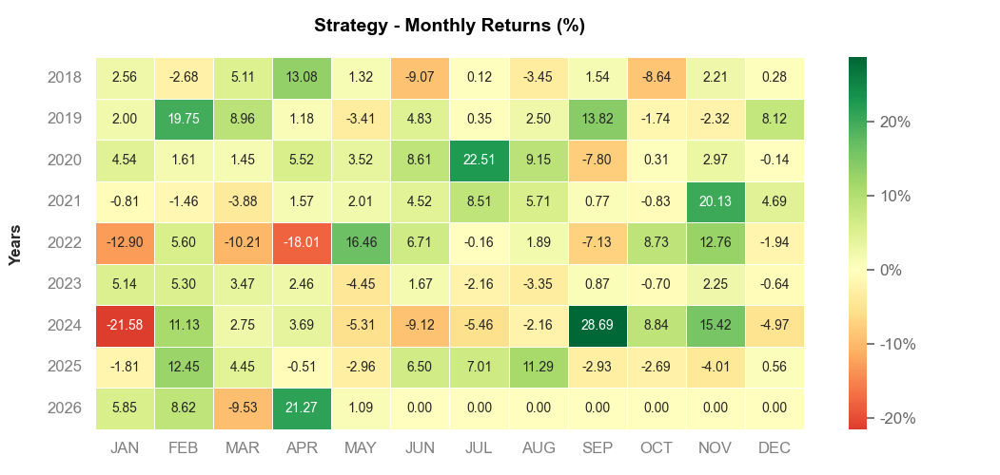
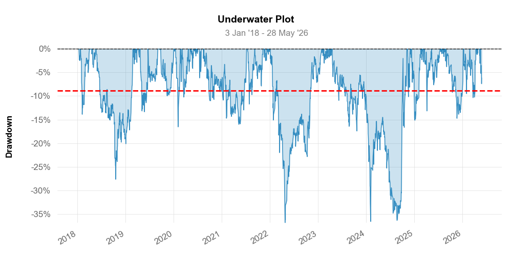

# 中证 1000 指数增强量化策略 (CSI 1000 Quant Strategy)

本项目是基于 QuantConnect Lean 架构与多模型 GBDT 算法实现的 **中证 1000 指数增强量化策略**。通过机器学习预测个股超额收益并使用凸优化器 (CVXPY) 求解投资组合权重，实现在控制风险偏离的前提下捕获最大超额 Alpha。

---

## 📈 策略表现与核心指标

以下为策略在 **2018年1月2日 - 2026年5月28日** 完整回测区间内的表现指标对比：

| 指标 | 原始基准模型 (97个因子) | 最终优化模型 (108个核心因子) | 中证 1000 指数 (基准) | 最终 vs 原始 变动 |
| :--- | :---: | :---: | :---: | :---: |
| **特征维度 (Features)** | 97 | **108** (包含基本面与AI因子) | -- | +11 |
| **年化收益率 (Ann. Return)** | 18.91% | **27.03%** | -2.65% | **+8.12%** |
| **夏普比率 (Sharpe Ratio)** | 0.72 | **0.99** (逼近 1.00) | -- | **+0.27** |
| **最大回撤 (Max Drawdown)** | -45.20% | **-36.91%** | -48.51% | **+8.29% (回撤大幅收窄)** |
| **卡玛比率 (Calmar Ratio)** | 0.42 | **0.73** | -- | **+0.31** |
| **交易保护 (Safeguards)** | 已启用 | **已启用 (符合真实 A 股流动性)** | -- | -- |

> [!NOTE]
> **关于交易保护 (Safeguards) 与实盘落地**：
> 本策略强制执行了严格的 A 股交易保护（涨跌停无法买入/建仓，停牌/跌停无法平仓/卖出）。这规避了回测中的“流动性幻觉”（即假设能以收盘价瞬间进出锁死个股），确保回测曲线完全可实盘落地。

---

## 📊 回测图表展示

### 1. 累计净值曲线 (Cumulative NAV)
策略在历史回测区间内大幅跑赢中证 1000 基准指数，显示出极强的 Alpha 捕获能力。


### 2. 年度超额收益率 (Yearly Excess Return)
在几乎所有年度，策略均实现了稳定的超额收益（扣除费率与真实交易摩擦后）。


### 3. 月度收益率热力图 (Monthly Returns Heatmap)
展现策略在不同市场环境下的月度绝对收益分布。


### 4. 历史回撤分析 (Underwater Drawdown)
策略的净值回撤深度及超额收益回撤轨迹，整体控制在合理水平。


---

## 🤖 AI 因子自动挖掘系统

本项目集成了**“AI 因子自动发掘与评估系统”**。该系统基于大模型（Gemini 2.5 Flash）和本地数据校验闭环：
1. 自动调用 Gemini 接口生成具有强经济学直觉的候选选股因子。
2. 进行第一关筛选：检查 Rank IC 显著性 (`|Mean IC| >= 0.008`) 和信息比率 (`|IR| >= 0.05`)，以及进行共线性校验（与已有因子相关系数 `< 0.70`）。
3. 进行第二关筛选（夏普门禁）：将候选因子临时写入 `custom_factors.py`，调用回测模拟器进行全样本 GBDT 重训与组合优化回测。若新夏普比率低于基准夏普比率，触发自动 rollback（擦除代码与记录），从而规避“伪 Alpha 噪音”和过拟合。

当前已接受并固化的高贡献自定义因子：
* **成交量加权价格区间动量 (`volume_weighted_range_momentum`)**：捕捉 10 日滚动窗口内由成交量加权的日内收盘价相对位置，从而识别机构的“筹码积累”与“筹码派发”行为。

---

## 🚀 快速启动与开发指南

详情请参阅项目宪法：[CLAUDE.md](CLAUDE.md)。

所有脚本已完成 portable 改造，使用动态相对路径，不依赖任何绝对路径或特定 AI 交互 ID，支持任何新 AI 助手一键接管。

### 1. 本地回测运行
```powershell
# 运行完整回测模拟（滚动重训 GBDT 并计算 NAV，生成 metrics 和 detailed stats）
.venv\Scripts\python.exe scripts/run_backtest.py
```

### 2. 刷新性能报告与 QuantStats HTML Tear Sheet
```powershell
# 生成最新的对比图表及 QuantStats 网页报告
$env:PYTHONUTF8=1; .venv\Scripts\python.exe generate_quantstats_report.py
```
* 刷新后的 HTML 交互报告保存在 `reports/quantstats_report_30.html`。
* 生成的图表自动输出到 `figures/` 目录下。

### 3. 特征重要性与相关性诊断
```powershell
# 对所有 108 个特征进行 GBDT 分裂重要性诊断与高相关性特征排查
.venv\Scripts\python.exe scripts/diagnose_features.py
```
* 结果以 JSON 形式保存在 `reports/feature_diagnostic.json`。

### 4. 运行 AI 因子自动发掘闭环
```powershell
# 启动 Gemini + 本地回测 Sharpe 门禁的因子挖掘循环
$env:GOOGLE_API_KEY="您的GeminiKey"; $env:PYTHONUTF8=1; .venv\Scripts\python.exe scripts/factor_research_loop.py
```

### 5. 计算最新调仓 holdings 列表
```powershell
# 预测最新截面收益率并使用 CVXPY 求解组合最优权重
.venv\Scripts\python.exe scripts/get_current_holdings.py
```
* 输出的目标持仓权重保存在 `reports/latest_holdings.json` 和 `target_portfolio.json`。

### 6. 实盘/模拟盘 Alpaca 调仓执行
```powershell
# 使用 Alpaca API 自动化进行账户持仓与 target_portfolio.json 的同步 rebalance
$env:ALPACA_API_KEY="xxx"; $env:ALPACA_SECRET_KEY="xxx"; .venv\Scripts\python.exe rebalance_alpaca.py --dry-run
```
